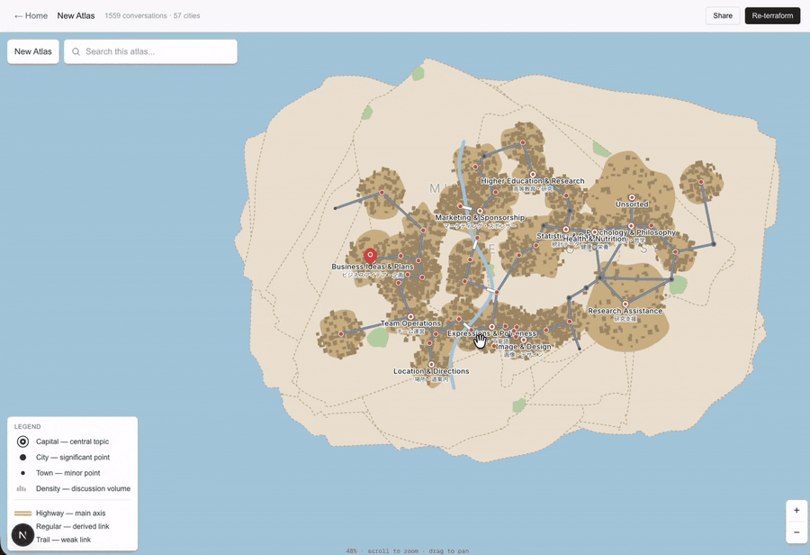

# Atlas of Thought

> **思考を都市として見る。** AI とのチャット履歴を読み込ませると、自分の頭の中の地形が Google Maps 風アトラスとして立ち上がる。

<p align="center">
  
</p>

<p align="center">
  📺 <a href="docs/assets/full-demo.mp4">Full demo (30 sec)</a>
</p>

[English README](./README.md) · [サンプルデモ](#ライブデモ) · [Discord (準備中)]

---

Atlas of Thought は、ChatGPT / Claude / Gemini との会話履歴を **生きた地理マップ** に変換するツール:

- **国 (Countries)** — 大きなテーマ ("健康・栄養"、"ソフトウェア・ツール"等)
- **都市 (Cities)** — 個別アイデアのクラスタ
- **POI** — 各会話。クリックで原文を再表示
- **高速 (Highways)** — 意味的に強く繋がる都市同士を結ぶ
- **河川・橋・IC** — 都市計画の手法で procedural 生成

実際の都市計画数学に基づいて構築:Euclidean MST + Delaunay 三角分割で道路の planar 性を保証、FHWA 機能分類風の階層、密度閾値による市街地区画化、各クラスタごとに Voronoi セルでクリップされた碁盤目街路。

**OSS、ローカルファースト、BYOK** (Bring Your Own Key)。チャット履歴が自分のマシンから出ることはない。

## なぜ?

今の AI チャット UI は線形 (リニア)。スクロールして検索して、忘れる。何十セッションにも渡って積み重ねたアイデアの繋がりはタイムラインに埋もれる。Atlas of Thought は会話を **地形** として扱う — 人間の脳は文字より空間の方が圧倒的に記憶できる。

類似ツール (ChatGPT-2D、ChatMap、Obsidian Canvas) はノードリンク図で止まる、または手作業レイアウトを要求する。Atlas of Thought は会話の形から **本物の地理マップ** を自動生成する — 国、都市、道路、河川まで。

## ダウンロード (デスクトップアプリ)

`v*.*.*` git tag が push されると GitHub Actions が **unsigned** な Mac / Windows / Linux インストーラを自動ビルドして GitHub Releases に添付。初回起動 (1 回だけ追加クリック):

- **macOS**: アプリを右クリック → *開く* → 確認
- **Windows**: SmartScreen 警告で *詳細情報* → *実行*
- **Linux**: AppImage は `chmod +x` 必要なことあり

インストール後: アプリ起動 → Settings で LLM API key 貼る → 履歴 import → *Terraform*。

## クイックスタート (Solo モード、ソースから 5 分)

ソースから走らせる場合 (開発したい人 / binary が自分のプラットフォーム向けにまだない人)。SQLite、Postgres 不要、Docker 不要、GitHub OAuth 不要。

**前提:** Node 20+ (or 22+)。

```bash
git clone https://github.com/ijichi-art/atlas-of-thought.git
cd atlas-of-thought
npm install
cp .env.example .env.local

# API key 暗号化用のシークレット生成:
echo "ENCRYPTION_KEY=\"$(openssl rand -base64 32)\"" >> .env.local

# ローカル SQLite DB 作成:
npx prisma db push

# 起動:
npm run dev
```

開発サーバーが起動したら、ターミナルに表示された URL を開く。Settings に
LLM API key を貼る (DeepSeek なら 1500 会話地図 1 回で約 $0.30、OpenAI
約 $3、Anthropic $5〜$15) → Import → Terraform。

地図は `prisma/dev.db` に保存される。

## ライブデモ

> *(サンプルデータでセットアップなしに見られるデモを準備中。)*

## スタック

Next.js 16 (App Router) · TypeScript · Tailwind 4 · Prisma + SQLite (better-sqlite3) · D3-force / D3-delaunay · Anthropic SDK · OpenAI SDK · DeepSeek API · Framer Motion。

## アーキテクチャ (1 段落)

3 ステージ:(1) **Cartographer LLM** が各会話を読んで国/地区/都市に割り当て、決定論的な JSON クラスタ木を出力;(2) **Force レイアウト** が d3-force で 2D 配置 (意味的 edges を link 力に);(3) **Procedural 生成** が Delaunay 三角分割を通る Euclidean MST を引き (交差ゼロの planar 道路網)、迂回比上位 5 本のショートカット高速を追加、地図ごとに大河 1 本を生成、POI を中心バイアスで散布、各クラスタの市街地ポリゴン内にビル輪郭 + 回転街路グリッドを Voronoi セルでクリップして配置。

結果:**意味的近さ = 地理的近さ**で、繰り返し話題に出てくる topic 同士が道で繋がる、本物の都市っぽい地図。

## ロードマップ

- ✅ **Phase 0** — 基盤 (Next.js + Prisma)
- ✅ **Phase 1** — 地図ビューア (d3-zoom 付き SVG アトラス)
- ✅ **Phase 2** — Importers (ChatGPT JSON+HTML / Claude / Claude Code / Gemini Takeout)
- ✅ **Phase 3** — 任意の都市から会話を resume
- ✅ **Phase 4** — Auto-terraform (LLM cartography + Euclidean MST + 5 bypass shortcuts)
- ✅ **Phase 5** — 地図内検索 (Google Maps 風)
- ✅ **Solo モード** — SQLite + 認証なしで 1 台で動く
- ✅ **Electron 版** — デスクトップアプリ、ダブルクリック (unsigned リリース)
- 🚧 **Public launch** — Show HN、Product Hunt
- 🔮 **Publish snapshot** — オプトインのクラウド共有 (静的 render のみ)
- 🔮 **都市間比較・artifact landmarks**

## BYOK (Bring Your Own Key)

自分の LLM API key を持ち込む。対応プロバイダ:

| プロバイダ | terraform 最安モデル | 1500 会話地図 1 回あたり |
|---|---|---|
| **DeepSeek** | `deepseek-chat` (V3) | **約 $0.30** |
| **OpenAI** | `gpt-4o-mini` | 約 $0.50 |
| **Anthropic** | `claude-haiku-4-5` | 約 $3 |

key は AES-256-GCM で暗号化されて SQLite にローカル保存。ソース版は
`.env.local` の `ENCRYPTION_KEY` を使い、デスクトップ版はマスターキーを
自動生成して OS の資格情報ストアで保護する。**API key がマシン外に出るのは、
選んだプロバイダへの outbound HTTPS だけ**。

> ⚠️ ソース版で `ENCRYPTION_KEY` を rotate すると、保存済み API key が
> 読めなくなる。デスクトップ版の生成済み key は OS の資格情報ストアに保持される。

## プライバシー

- **設計上ローカルファースト**。すべての会話と生成された地図は `prisma/dev.db` にしか存在しない。
- **テレメトリなし、アナリティクスなし**。outbound HTTPS は *Terraform* ボタン押した時 (選んだ LLM プロバイダへ) と Phase 5+ の共有 URL を開いた時 (オプトイン) のみ。
- **中央サーバなし**。あなたのデータを持つ atlas-of-thought.com は存在しない。将来の *Publish snapshot* 機能はあなたが選んだ地図 1 つの静的 render だけをアップロードする — 元のチャットデータは絶対に上がらない。
- **Importer はファイルをローカルでパースする**。ChatGPT export zip は Node プロセスで読まれ、内容は cartographer LLM 呼び出し以外には送られない。

## License

MIT — [LICENSE](./LICENSE) 参照。

## Contributing

[CONTRIBUTING.md](./CONTRIBUTING.md) 参照。PR 歓迎、特に: import parser (他チャットツール対応)、cartographer prompt の言語サポート、パッケージング修正。

## Credits

[@ijichi-art](https://github.com/ijichi-art) 作成。Google Maps の操作感、Obsidian のプライバシー思想、抽象概念を物理地理にマッピングするデータアートの伝統に着想を得た。

役に立ったらスターを ⭐ — OSS プロジェクトの優先度を決める一番安い signal。
